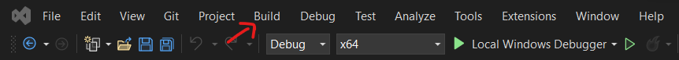
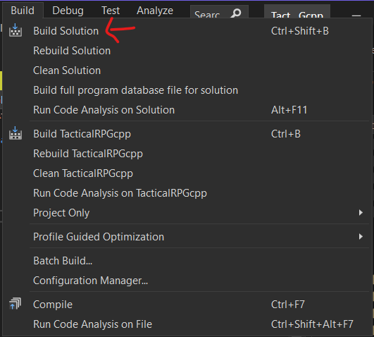

# Tactical RPG

<a name="readme-top"></a>

<!-- TABLE OF CONTENTS -->
<details>
  <summary>Table of Contents</summary>
  <ol>
    <li><a href="#about">About</a>
    <li><a href="#installation">Installation</a>
      <ul>
        <li><a href="#executable">Executable</a></li>
        <li><a href="#source">Source</a></li>
      </ul>
    </li>
    <li><a href="#tutorial">Tutorial</a></li>
      <ul>
        <li><a href="#menu">Menu</a></li>
        <li><a href="#game">Game</a></li>
      </ul>
    <li><a href="#features">Features</a></li>
    <li><a href="#usage">Usage</a></li>
    <li><a href="#contact">Contact</a></li>
  </ol>
</details>

<!-- ABOUT -->
## About

This is a tactical RPG game made in C++ using the SFML library. The game is a turn-based strategy game where the player controls a team of 5 characters.
The goal of the game is to defeat all enemies on the map. The player can move their characters around the map and attack enemies. The player can also use items to heal their characters or to inflict damage on enemies.
The player can also use special abilities to inflict damage on enemies. The game is turn-based, so the player can only move and attack once per turn. The enemies also have a turn, and they will move towards the player's characters and attack them.
The game ends when all enemies are defeated or when all player characters are defeated.

<!-- INSTALLATION -->
## Installation

<!-- EXECUTABLE STEPS -->
### Executable

Download and launch **setup.msi**. A shortcut will appear in your Desktop. The software is now installed and ready to be used.

<!-- SOURCE STEPS -->
### Source

1. Clone the repository
   ```bash
   git clone https://github.com/Marwane-Amzil/TacticalRPG.git
   ```

2. Open the ``.sln`` file if you're using Visual Studio, open the whole folder in your IDE of choice if you're using something else.

3. Build the project.

**For Visual Studio** :
    
- Click on the ``Build`` button.  Be sure to check which configuration you're using. Either **Debug** mode or **Release** mode.
>
- Click on ``Build Solution``.
>
    
**For other IDEs** :
- Install [CMake](https://cmake.org/download/)
- Once installed, open a command prompt in your project directory.
- Run the following commands:
```bash
cd build // Go to the build directory
cmake .. // Invoke CMake and pass the parent folder containing the CMakeLists.txt file
make // Call make once the build files have been regenerated
```

<!-- Tutorial -->
## Tutorial

<!-- MENU -->
### Menu

The game starts with a menu. The player can choose to start the game, check the credits, edit the settings of the game or quit the game.

<!-- GAME -->
### Game

Before starting the game, players will need to choose their characters to form their team. Each player will be using a set of 5 characters.
Players will select their characters from a list of 5 characters, each being either red or blue for team blue and team red.
Once the selection is done, the game will compute the "will" of each character to get the total will of your team. It will determine who's going first.
The game will then start. The player will be able to move their characters around the map and attack enemies. The player can also use items to heal their characters or to inflict damage on enemies.
To do an action with a character, you have to click on a character and a menu will be shown.
The player can also use special abilities to inflict damage on enemies. The game is turn-based, so the player can only move and attack once per turn. The enemies also have a turn, and they will move towards the player's characters and attack them.

<!-- FEATURES -->
## Features

- [X] Deploy your characters
- [ ] Play with characters
- [ ] Win or Lose

<!-- CONTACT -->
## Contact

Houssam CUMZAIN - cumzain.houssam@gmail.com\
Marwane AMZIL - marwaneamzil5@gmail.com\
Thomas LORIDAN - thomasipod59122@gmail.com

Project Link: [https://github.com/Marwane-Amzil/TacticalRPG.git](https://github.com/Marwane-Amzil/TacticalRPG.git)